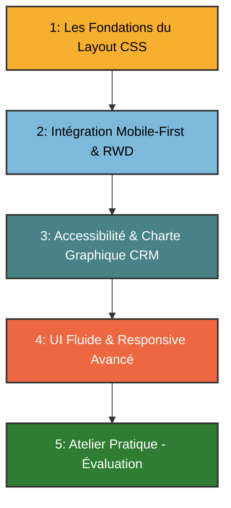

## Progression pédagogique : Architecture du module UI




---

## Introduction CSS

### 1. HTML & CSS

* **Le HTML :**  les murs et la structure de la maison.
* **Le CSS :** la peinture, la décoration et l'agencement des pièces.

### 2. La syntaxe d'une règle CSS

Il faut décoder l'anatomie d'une ligne de code pour qu'ils sachent la lire :

* **Le Sélecteur** : *Qui* je veux modifier ? (Exemple : `h1`)
* **La Propriété** : *Quoi* je veux modifier ? (Exemple : `color`)
* **La Valeur** : *Comment* je veux le modifier ? (Exemple : `blue`)

```css
sélecteur {
    propriété: valeur;
}
```


### Module 1 : Les Fondations du Layout 

**Objectif :** Maîtriser le positionnement dans l'espace à deux dimensions avant de le rendre responsive.

* **1.1 Introduction CSS**
    * Le rôle du CSS.
    * La syntaxe de base.

* **1.2 BoxModel : Disposition**
    * Les éléments : Content, Padding, Margin, Border.
    * Les boites : Display, Position.
    * Les couleurs et les contrastes.

* **1.2 Flexbox : L'alignement sur un axe unique**
    * Le concept : Parent `display: flex` / Enfants.
    * Les axes : `flex-direction` (horizontal ou vertical).
    * L'alignement : `justify-content` (répartition) et `align-items` (alignement).

* **1.3 CSS Grid : La structure en deux dimensions**
    * Le concept : Les colonnes et les lignes.
    * La puissance de `grid-template-columns` et de la fonction `repeat()`.
    * L'espacement natif sans marge : `gap`.


---

### Module 2 : L'Intégration Mobile-First et le Responsive de Base

**Objectif :** Appliquer le support *responsive.md* pour créer un site adaptable.

* **2.1 Pourquoi commencer par le mobile ?**
    * Contraintes d'espace et de performance.
    * La structure par défaut sans Media Query.


* **2.2 Les points de rupture (Breakpoints)**
    * Mise en pratique du tableau standard : `768px` / `1024px` / `1280px`.
    * Écriture des premières requêtes `@media (min-width: ...)`.

* **2.3 Grid Auto-adaptatif (Le responsive sans Media Query)**
    * Utilisation de `grid-template-columns: repeat(auto-fit, minmax(250px, 1fr))`.


---

### Module 3 : Accessibilité (RGAA), Design Défensif et Application de la Charte CRM

**Objectif :** Connecter la technique aux règles strictes du *README.md*.

* **3.1 L'Accessibilité UI et DYS**
* L'unité `rem` : pourquoi et comment abandonner définitivement le pixel (`px`) pour le texte.
* Mise en œuvre du commutateur de police pour `OpenDyslexic`.
* Vérification des contrastes des couleurs CRM fournis.


* **3.2 Les lois d'ergonomie**
* **Loi de Fitts :** Créer des zones cliquables d'au moins `44px` par `44px` (utilisation du padding).
* **Defensive Design :** Empêcher la casse de l'UI avec `overflow: hidden`, `text-overflow: ellipsis` ou `flex-wrap`.


---

### Module 4 : UI Fluide et Responsive Avancé

**Objectif :** Passer à la vitesse supérieure avec le support *responsive-senior.md*.

* **4.1 La nouvelle syntaxe CSS**
* Pratique des opérateurs : `@media (width >= 768px)`.


* **4.2 Typographie et Espacements Élastiques**
* Calculer et appliquer la fonction `clamp(mini, dynamique, maxi)`.


* **4.3 Les Container Queries (L'autonomie des composants)**
* Déclarer un parent : `container-type: inline-size`.
* Adapter le composant : `@container (width >= 500px)`.


---

### Module 5 : Cas Pratique de Synthèse (Le livrable d'évaluation)

**Objectif :** Valider les acquis de manière autonome (Créer).

* **Sujet recommandé :** Intégration d'un tableau de bord (Dashboard) CRM comprenant une barre latérale (Sidebar), une grille de cartes (Cards) et un formulaire de saisie.
* **Contraintes obligatoires :**
* Intégration 100% Mobile-First.
* Respect strict de la palette couleur et typographique du *README.md*.
* Intégration du bouton de bascule Mode Clair / Mode Sombre.
* Zéro utilisation des pixels (`px`) pour la typographie.


---

## Éléments clés spécifiques à intégrer (prochains supports)

Pour maintenir l'accessibilité aux apprenants en situation de handicap (TDAH / TSA), les prochains documents devront inclure :

1. **Des fiches de triche (Cheat Sheets) visuelles** pour Flexbox et Grid (utiliser des schémas Mermaid d'alignement).
2. **Des exercices guidés par étapes courtes**, évitant les longs blocs de théorie.
3. **Un script de démarrage CSS (`crm-main.css`) pré-rempli** avec les variables de couleur de votre charte pour leur éviter la charge cognitive de la configuration initiale.

Que souhaitez-vous que nous rédigions en premier : le guide pratique sur Flexbox/Grid en méthode FALC, ou le gabarit CSS complet avec les variables de la charte ?