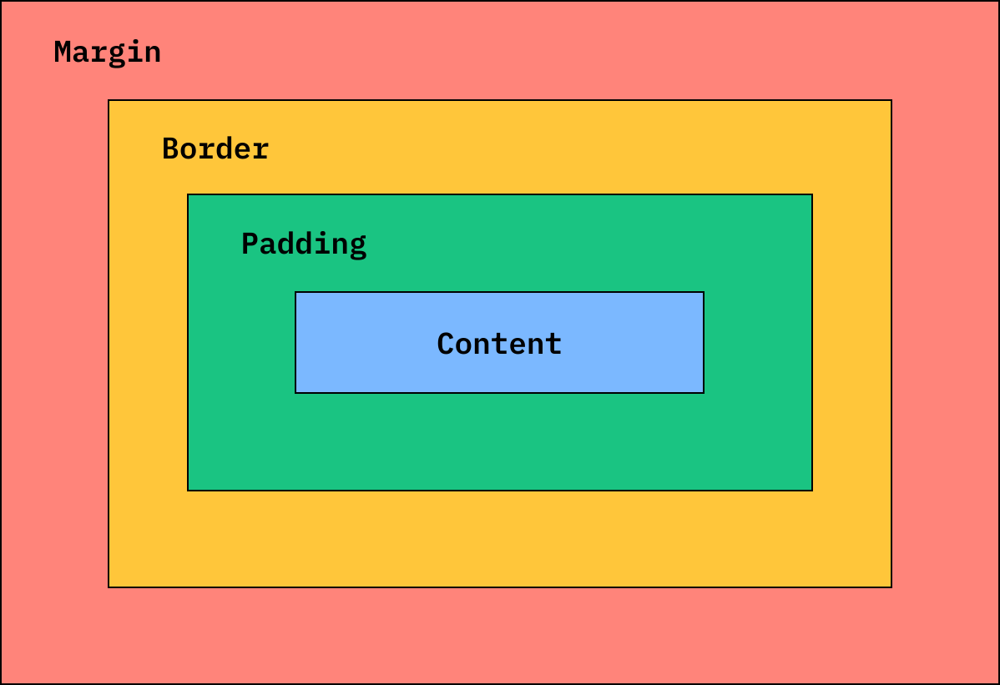
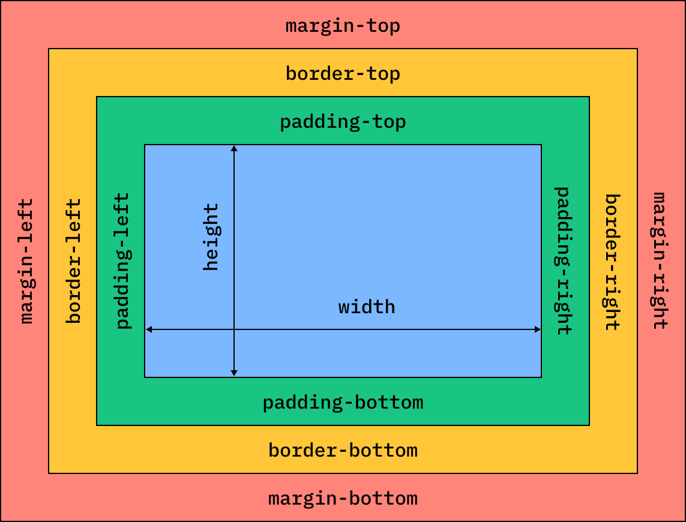
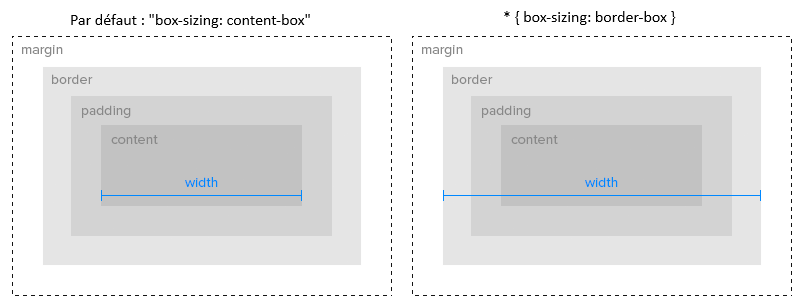

# Le Modèle de Boîte et le Positionnement CSS

**Objectif :** Apprendre à placer les éléments sur une page web.


## 1. Le Modèle de Boîte (*Box Model*)

En CSS, chaque élément HTML est une **[boîte rectangulaire](https://developer.mozilla.org/fr/docs/Learn_web_development/Core/Styling_basics/Box_model)**.
Chaque élément dispose de [4 zones](https://developer.mozilla.org/fr/docs/Learn_web_development/Core/Styling_basics/Box_model#quest-ce_que_le_mod%C3%A8le_de_bo%C3%AEte_css) (de l'intérieur vers l'extérieur) :

| Zone | Nom technique | Emplacement | Rôle principal |
| --- | --- | --- | --- |
| **Contenu** | Content | Au centre de la boîte | Affiche le texte, l'image ou la vidéo. |
| **Rembourrage** | [Padding](https://www.google.com/search?q=%5Bhttps://developer.mozilla.org/fr/docs/Web/CSS/Reference/Properties/padding%5D(https://developer.mozilla.org/fr/docs/Web/CSS/Reference/Properties/padding)) | **À l'intérieur** de la boîte | Crée de l'espace vide directement autour du contenu. |
| **Bordure** | [Border](https://www.google.com/search?q=%5Bhttps://developer.mozilla.org/fr/docs/Web/CSS/Reference/Properties/border%5D(https://developer.mozilla.org/fr/docs/Web/CSS/Reference/Properties/border)) | Autour du rembourrage | Dessine le trait de contour de la boîte. |
| **Marge** | [Margin](https://www.google.com/search?q=%5Bhttps://developer.mozilla.org/fr/docs/Web/CSS/Reference/Properties/margin%5D(https://developer.mozilla.org/fr/docs/Web/CSS/Reference/Properties/margin)) | **À l'extérieur** de la boîte | Crée de l'espace vide pour pousser les éléments voisins. |

---



Chaque zone (à l'exception du contenu) possède 4 côtés définis, ce qui permet de les manipuler individuellement ; le contenu, quant à lui, ne possède qu'une largeur et une hauteur : 




### Le cas `border-box`

Par défaut, le padding et la bordure s'ajoutent à la largeur d'une boîte. Cela peut casser la mise en page.

Pour éviter cela, toujours ajouter cette règle au début du CSS :

```css
*, *::before, *::after {
    box-sizing: border-box;
}
```

En utilisant le [sélecteur CSS universel (*)](https://developer.mozilla.org/fr/docs/Web/CSS/Reference/Selectors/Universal_selectors) et la règle [box-sizing](https://developer.mozilla.org/fr/docs/Web/CSS/Reference/Properties/box-sizing) avec la valeur `border-box`, le padding et la bordure sont inclus dans la largeur globale. Le site reste stable (*Defensive Design*).



---

## 2. Le comportement et le placement des boîtes

### La propriété [display](https://developer.mozilla.org/fr/docs/Web/CSS/Reference/Properties/display)

Il existe 3 comportements principaux pour une boîte :

| Valeur | Comportement sur la ligne | `width`/`height` | Exemples courants | 
| --- | --- | --- | --- | 
| **`display: block;`** | Prend **toute la largeur** disponible.<br>Va automatiquement à la ligne. | **Oui** | `<h1>`, `<p>`, `<div>` | 
| **`display: inline;`** | Prend uniquement la **largeur de son contenu**.<br>Reste sur la même ligne. Non dimensionnable | **Non** | `<a>`, `<span>`, `<strong>` | 
| **`display: inline-block;`** | Prend uniquement la **largeur de son contenu**.<br>Reste sur la même ligne. | **Oui** |  | 

---

### La propriété [position](https://developer.mozilla.org/fr/docs/Web/CSS/Reference/Properties/position)

Pour déplacer une boîte précisément, on change son mode de positionnement :

* **`position: static;`** : C'est le placement normal par défaut. Les boîtes se suivent naturellement.
* **`position: relative;`** : La boîte reste à sa place normale, mais vous pouvez la décaler légèrement. Elle sert surtout de "parent repère" pour un enfant en position absolue.
* **`position: absolute;`** : La boîte sort du flux normal de la page. Elle flotte. Elle se place avec précision par rapport à son premier parent qui possède une `position: relative;`.

---

## 3. Les Couleurs et les Contrastes

Pour l'accessibilité de vos interfaces (norme [RGAA](https://accessibilite.numerique.gouv.fr/)), vous devez respecter deux règles strictes sur les couleurs :

### Utiliser uniquement la palette de la charte

Vous devez utiliser uniquement les codes couleurs fournis dans les consignes ou dans la charte graphique (par exemple, la couleur primaire CRM `#1b296a` ou secondaire `#ed6840`).

### Assurer un contraste suffisant

Le texte doit être très facile à lire. [La couleur du texte doit contraster fortement avec la couleur du fond](https://accessibilite.numerique.gouv.fr/methode/criteres-et-tests/#3) :

* Sur un fond clair, afficher le texte avec une couleur sombre.
* Sur un fond sombre , afficher le texte avec une couleur claire.

| Couleur de fond | Type de fond | Couleur de texte |
| --- | --- | --- |
| `#FFFFFF` | Clair | Sombre (Ex: `#111111`) |
| `#1B296A` | Sombre | Clair (Ex: `#FFFFFF`) |

---

## Exercice Pratique : Objectif "Loi de Fitts"

**Consigne :** Créez un lien `<a>` pour un bouton.

1. Transformez-le en `inline-block`.
2. Utilisez le `padding` pour que sa zone cliquable mesure au moins $44\text{px} \times 44\text{px}$ pour les téléphones mobiles.
3. Appliquez la couleur de fond `#1B296A` et assurez-vous que le texte reste lisible en appliquant une couleur adaptée.

## Ressources 

<iframe width="800" height="450" src="https://www.youtube.com/watch?v=KCWFaZJx_Ig" title="YouTube video player" frameborder="0" allow="accelerometer; autoplay; clipboard-write; encrypted-media; gyroscope; picture-in-picture; web-share" referrerpolicy="strict-origin-when-cross-origin" allowfullscreen></iframe>
